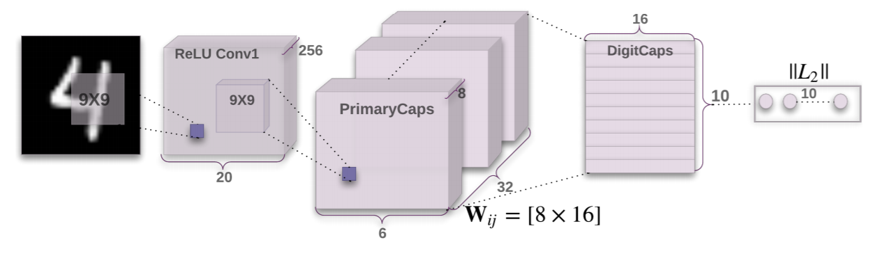

# CapsNet

[](CONTRIBUTING.md)
[](https://opensource.org/licenses/Apache-2.0)

A tensorflow implemention of CapsNet in [Dynamic Routing Between Capsules](https://arxiv.org/abs/1710.09829)


## Requirements
- Python3
- NumPy
- [Tensorflow >= 1.3](https://github.com/tensorflow/tensorflow)

## Usage
**Step 1.** 
Clone this repository with ``git``.

```
$ git clone https://github.com/VectorFist/CapsNet.git
$ cd CapsNet
```

**Step 2.** 
Download the [MNIST dataset](http://yann.lecun.com/exdb/mnist/), extract it into ``MNIST_data`` directory.

**Step 3.** 
Start the training:
```

$ python run_capsnet.py
```

**Step 3.** 
Test capsnet model:
```

$ python run_capsnet.py --run_mode=test
```
